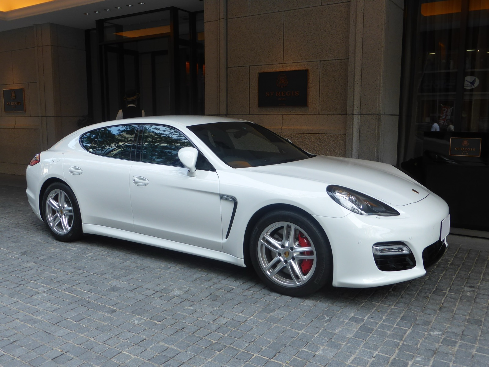
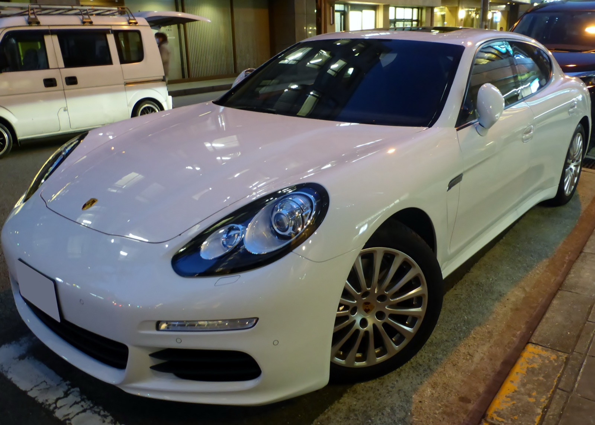

# Porsche Panamera 970.1–970.2 — универсальная шпаргалка

**Версия:** 1.0  
**Срез рынка РФ:** 13 сентября 2026

> **Охват:** только Porsche Panamera первого поколения 970: дорестайлинг **2009–2013** и рестайлинг **2013–2016**, прежде всего в конфигурациях, реально встречающихся на рынке РФ.
>
> **Цель:** по одному документу понять шильдик, двигатель, мощность, привод, коробку, склонность к задирам, типовые проблемы, стоимость крупных ремонтов, регламент обслуживания, жидкости, топливо, PPI и адекватную цену покупки на вторичном рынке.
>
> **Важно:** Panamera 970 сильно зависит от VIN, рынка, модельного года, кода двигателя/коробки, привода, PCCB, PDCC, пневмоподвески и гибридной системы. Заправочные объёмы — ориентиры; перед покупкой расходников финально сверять VIN/PET/PIWIS/мануал.

---

## Оглавление

- [Какую Panamera 970 покупать — короткий ответ](#which-one)
- [Panamera 970.1 — 2009–2013](#panamera-9701)
- [Рынок РФ: 970.1](#market-9701)
- [Panamera 970.2 — 2013–2016](#panamera-9702)
- [Рынок РФ: 970.2](#market-9702)
- [Коробки и привод](#transmissions)
- [Регламент обслуживания](#maintenance)
- [Масла ДВС: допуски, вязкости и объёмы](#engine-oil)
- [Остальные жидкости](#fluids)
- [Топливо](#fuel)
- [PPI перед покупкой](#ppi)
- [Короткий полевой PPI](#field-ppi)
- [Шкала стоимости ремонтов](#repair-costs)
- [Короткая карта всей линейки](#quick-map)
- [Источники и подход к данным](#sources)
- [REFERENCES.md](REFERENCES.md)
- [CHANGELOG.md](CHANGELOG.md)
- [TL;DR](#tldr)

---

# Какую Panamera 970 покупать — короткий ответ

| Поколение | Самый рациональный | Рациональный бензин | Самый интересный | Финансово опасный без идеального PPI |
|---|---|---|---|---|
| **970.1** | **Diesel 250** | **3.6 300**, но только после эндоскопии и проверки PDK | **GTS 430** | **Turbo/Turbo S; S Hybrid без HV-диагностики** |
| **970.2** | **Diesel 250/300** | **3.6 310**, но только после эндоскопии и проверки PDK | **GTS 440 / 4S 420** | **Turbo S; S E-Hybrid без HV-диагностики** |

Ключевая мысль всего гайда:

> **3.6 V6 Panamera — не фольксвагеновский чугунный VR6 Cayenne.** Это Porsche V6 семейства M46/MCW с алюминиевым блоком; классическая логика «базовый Cayenne 3.6 не задирный» сюда не переносится. Бензиновую Panamera 970 разумно покупать с эндоскопией независимо от числа цилиндров.

### Легенда ремонтопригодности

- 🟢 — агрегат хорошо изучен, запчасти и компетенции широко доступны;
- 🟡 — ремонтируется нормально, но дорого и/или требует профильного сервиса;
- 🟠 — специализированный ремонт, дорогие узлы или ограниченные компетенции;
- 🔴 — крайне тяжёлый или экономически сомнительный ремонт.

`Ремонтопригодность` — это не то же самое, что финансовый риск `💸`: технически ремонтируемый агрегат может быть очень дорогим.

---

# Porsche Panamera 970.1 — 2009–2013

  

Фото: <a href="https://commons.wikimedia.org/wiki/File:Porsche_970_Panamera_front.JPG">Tokumeigakarinoaoshima / Wikimedia Commons</a> — CC0 1.0.

| Название | Мотор | Код мотора | Мощность | Привод | Коробка | Код КПП | Задиры | 💸 |
|---|---|---|---:|---|---|---|---|---|
| **Panamera** | **3.6 V6 бензин, атмо DFI** | **M46.20** | **300 л.с.** | RWD | 7PDK; редко 6MT | **C70.00 / G70.00** | 🟠 Возможны | 🟡 |
| **Panamera 4** | **3.6 V6 бензин, атмо DFI** | **M46.40** | **300 л.с.** | AWD | 7PDK | **C70.30** | 🟠 Возможны | 🟡 |
| **Panamera S** | **4.8 V8 бензин, атмо DFI** | **M48.20** | **400 л.с.** | RWD | 7PDK; редко 6MT | **C70.05 / G70.00** | 🟠 Возможны | 🟠 |
| **Panamera 4S** | **4.8 V8 бензин, атмо DFI** | **M48.40** | **400 л.с.** | AWD | 7PDK | **C70.35** | 🟠 Возможны | 🟠 |
| **Panamera GTS** | **4.8 V8 бензин, атмо DFI** | **M48.40** | **430 л.с.** | AWD | 7PDK | **C70.35** | 🟠 Возможны | 🔴 |
| **Panamera Turbo** | **4.8 V8 бензин, biturbo DFI** | **M48.70** | **500 л.с.** | AWD | 7PDK | **C70.50** | 🟠/🔴 Возможны | 🔴 |
| **Panamera Turbo S** | **4.8 V8 бензин, biturbo DFI** | **M48.70** | **550 л.с.** | AWD | 7PDK | **C70.50** | 🟠/🔴 Возможны | ☠️ |
| **Panamera Diesel** | **3.0 V6 дизель, turbo** | **MCR.CC / EA897-CRCA family** | **250 л.с.** | RWD | 8AT Tiptronic S | **A70.10** | 🟢 Не типовая проблема | 🟢/🟡 |
| **Panamera S Hybrid** | **3.0 V6 бензин, компрессор + EV** | **MCG.EA / MCG.FA** | **380 л.с. системно** | RWD | 8AT Tiptronic S | **A70.00** | 🟡 Не главный риск | 🔴 HV |

## Что здесь происходит

### Самое важное про 3.6

Базовая Panamera внешне и по мощности может казаться самым простым и безопасным бензиновым вариантом. Она действительно проще S/Turbo: нет двух турбин, меньше тепловая нагрузка, дешевле многие сопутствующие узлы.

Но **M46.20 — не VR6 от Cayenne**. Это алюминиевый Porsche V6, конструктивно близкий к семейству V8 и использующий DFI. Для семейства Panamera/Cayenne/Macan с Alusil зафиксированы случаи bore scoring. Поэтому логика покупки простая:

**эндоскоп всех цилиндров обязателен даже на 3.6.**

Кроме цилиндров смотрим:

- цепной привод и фактические углы фаз;
- регулировку распредвалов;
- HPFP и низкое давление топлива;
- нагар на впуске;
- PCV;
- катушки/свечи;
- помпу, термостат и пластиковые/композитные элементы охлаждения;
- течи масла и антифриза.

**Итог:** самый понятный бензиновый 970.1, но не «железобетонный безопасный атмосферник».

### 4.8 S / 4S 400

Это атмосферный V8 семейства M48 с прямым впрыском. По ощущениям и характеру именно он делает раннюю Panamera тем автомобилем, каким её обычно представляют.

Типовые зоны внимания:

- bore scoring;
- фазорегуляторы и цепной привод;
- кампания по крепежу контроллеров распредвалов на применимых VIN ранних машин;
- HPFP/LPFP;
- нагар DFI;
- катушки;
- помпа/термостат;
- утечки масла/ОЖ.

Он значительно зрелее печально известного 4.5 M48.00 от раннего Cayenne S, но **алюминиевый блок не превращается от этого в неуязвимый**.

### GTS 430

Тот же фундамент M48.40, но более эмоциональная заводская настройка, полный привод, другой характер шасси и выхлопа.

GTS интереснее обычного 4S как автомобиль, но **не дешевле как объект обслуживания**. На рынке за живой GTS обычно просят премию, и эту премию имеет смысл платить только за реальное состояние, историю, правильный PPI и отсутствие колхоза.

### Turbo / Turbo S 500–550

M48.70 добавляет к рискам цилиндров:

- две турбины;
- масляные и охлаждающие магистрали;
- интеркулеры;
- более высокую температуру подкапотного пространства;
- дорогие тормоза и шасси;
- потенциально очень дорогой каскадный ремонт.

Живая Turbo — выдающаяся машина. Но цена объявления давно не отражает цену владения.

> **Дешёвая Turbo остаётся автомобилем, который новым стоил как Turbo, просто теперь ему 13–16 лет.**

### Diesel 250

MCR.CC — VAG/Porsche 3.0 TDI семейства EA897. Классические Alusil-задиры бензиновых Porsche здесь не являются главным сценарием.

Смотрим другое:

- EGR;
- DPF — soot/ash/delta-P и историю регенераций;
- заслонки впуска;
- течи в развале/теплообменник;
- турбину;
- форсунки;
- ТНВД и фактическое/заданное Rail pressure;
- цепи на больших пробегах;
- термостат и способность мотора выходить на нормальную температуру.

Именно **Diesel 250 — наиболее рациональный 970.1**, если нужен автомобиль, а не конкретно звук атмосферного V8.

### S Hybrid 380

Это не нынешний plug-in. Первая S Hybrid — параллельный full hybrid:

- бензиновый 3.0 V6 с механическим компрессором;
- 47-сильный электромотор;
- системные 380 л.с.;
- **NiMH-батарея около 1.7 кВт·ч**;
- 8AT Tiptronic S вместо PDK.

Возраст гибридной системы сейчас важнее красивых паспортных цифр. Покупать такую машину без специализированной диагностики HV — плохая идея.

### Сам Panamera 970.1

Помимо двигателя держим в голове:

- PDK и её датчики/мехатроник/сцепления;
- пневму, если установлена;
- PASM/PDCC;
- рычаги и сайлентблоки тяжёлого автомобиля;
- ступицы;
- активный задний спойлер и его дренаж/механизм;
- дренажи кузова и воду в салоне/багажнике;
- аккумулятор и каскад электрических ошибок от низкого напряжения;
- PCM;
- дорогие тормоза, особенно PCCB.

## Что реально приезжает, когда и сколько готовить

### M46.20 3.6

**80–150 тыс. км:** охлаждение, PCV, катушки/свечи, топливная мелочь, нагар, утечки.

**150–220+ тыс. км:** цепи/фазы/регуляторы становятся всё более актуальны.

У bore scoring **нет честной границы по пробегу**. Машина с 80 тыс. км может быть хуже обслуженной машины со 180 тыс.

**Ориентир по деньгам РФ, независимый профильный сервис, 2026:**

- катушки/PCV/датчики/мелкие течи: **15–60 тыс. ₽**;
- помпа/термостат/охлаждение: **40–120 тыс. ₽**;
- чистка впуска/топливная работа: **40–120 тыс. ₽**;
- цепи/фазы при большом заходе: **200–350 тыс. ₽**;
- полноценный ремонт цилиндров: **≈500–900 тыс. ₽ резерв**.

**Ремонтопригодность: 🟡/🟢.** Ремонтировать умеют; дешёвым это не становится.

### M48.20 / M48.40 4.8 атмосферный

Для применимых ранних VIN обязательно проверить, закрыта ли кампания по крепежу контроллеров распредвалов. Американский recall AH08 охватывал часть Panamera 2010–2012; рынок кампании зависит от страны, поэтому важен VIN и история Porsche.

**Деньги:**

- охлаждение/HPFP/впуск/PCV: **50–150 тыс. ₽**;
- фазы/ГРМ/крупная верхняя часть: **200–350+ тыс. ₽**;
- цилиндры/капиталка: **≈550–900 тыс. ₽**;
- большая комплексная дефектовка: **900 тыс. ₽+**.

**Ремонтопригодность: 🟡.** Главный критерий — купить здоровую базу, а не спасать самый дешёвый экземпляр.

### M48.70 Turbo / Turbo S

**Ориентир:**

- локальные магистрали/утечки/охлаждение: **40–150 тыс. ₽**;
- турбины/топливная/крупная работа: **150–400 тыс. ₽**;
- двигатель с цилиндрами: **≈650–950 тыс. ₽**;
- двигатель + турбины + ГБЦ + сопутствующее: **≈900 тыс.–1.3 млн+ ₽**.

**Ремонтопригодность: 🟡.** Технически понятна. Экономика требует резерва.

### MCR.CC Diesel

**80–150 тыс. км:** EGR, впуск, термостат, мелкие течи, датчики.

**150–250+ тыс. км:** DPF по золе, турбина, форсунки/топливная, цепи становятся реальным вопросом.

**Деньги:**

- EGR/впуск/локальные работы: **30–120 тыс. ₽**;
- турбина/форсунки/топливная: **80–220 тыс. ₽**;
- большой цепной ремонт: **180–300+ тыс. ₽**.

**Ремонтопригодность: 🟢/🟡.** Много профильных VAG-дизельных компетенций и запчастей.

### S Hybrid

Здесь фиксированный «прайс капиталки HV» нечестен. Возможен огромный разброс от локального восстановления до экономически бессмысленной замены крупного узла.

Практический резерв:

- локальная HV/электрическая/охлаждающая работа: **100–300 тыс. ₽**;
- серьёзная батарея/силовая электроника: **500 тыс.–1 млн+ ₽**;
- новый крупный оригинальный HV-узел может быть несоразмерен рыночной цене автомобиля.

**Ремонтопригодность: 🟠.** Покупка только после специализированного PPI.

### Общие болезни 970.1

**PDK:** датчики положения/штоков, мехатроник, соленоиды, сцепления, адаптации, утечки. Ошибки уровня P1731–P1738 требуют профильной диагностики, а не автоматического приговора всей коробке.

**Пневма:** баллоны/стойки, компрессор, клапанный блок, датчики уровня. Всё ремонтируется и восстанавливается.

**PDCC:** трубки, утечки, насос/давление. Система отличная, но ремонтировать её «как обычный стабилизатор» не получится.

**Активный спойлер:** вода и забитые дренажи, коррозия механизма/мотора, перекосы.

**12V:** слабый аккумулятор способен создать целый букет несвязанных ошибок. Сначала питание — потом охота на блоки.

**Тормоза:** обычные стальные — дорогие, но понятные. PCCB требуют отдельной оценки дисков, потому что ошибка при покупке легко превращается в шестизначный счёт.

### Рейтинг 970.1

**Diesel 250 → самый рациональный.**

**3.6 300 → самый понятный бензин, но эндоскоп обязателен.**

**GTS 430 → самый интересный атмосферный.**

**Turbo → взрослый бюджет содержания.**

**Turbo S → покупать состояние и историю, а не цену объявления.**

**S Hybrid → только ради конкретной хорошей машины и после HV-PPI.**

---

# Рынок РФ — Panamera 970.1, сентябрь 2026

## Как читать цены

Это **зоны цен предложения**, а не гарантированные цены сделки. Срез строится по Auto.ru, Avito и Drom с очисткой очевидных дублей, проектов, машин «не на ходу», нерепрезентативных импортных объявлений и условных кредитных/трейд-ин цен.

На Drom на момент среза отдельно отображалось более сотни дорестайлинговых 970; Auto.ru также даёт десятки предложений по основным модификациям. Для редких Turbo S/Hybrid/GTS статистическая устойчивость ниже.

| Версия | 🔴 Подозрительно дёшево | 🟠 Низ рынка | 🟢 Нормальный рынок | 🔵 Хороший экземпляр | 🟣 Верх рынка | Устойчивость |
|---|---:|---:|---:|---:|---:|---|
| **3.6 Base / 4, 300** | **<1.8 млн** | **1.8–2.2** | **2.2–2.8** | **2.8–3.4** | **>3.4** | средняя/высокая |
| **S / 4S 4.8, 400** | **<1.7 млн** | **1.7–2.1** | **2.1–2.9** | **2.9–3.5** | **>3.5** | средняя |
| **GTS 4.8, 430** | **<2.0 млн** | **2.0–2.4** | **2.4–3.1** | **3.1–3.8** | **>3.8** | средняя/низкая |
| **Turbo 4.8, 500** | **<1.9 млн** | **1.9–2.5** | **2.5–3.6** | **3.6–4.8** | **>4.8** | низкая, большой разброс |
| **Turbo S 4.8, 550** | **<2.5 млн** | **2.5–3.0** | **3.0–4.2** | **4.2–5.3** | **>5.3** | низкая |
| **Diesel 250** | **<2.2 млн** | **2.2–2.6** | **2.6–3.4** | **3.4–3.9** | **>3.9** | средняя |
| **S Hybrid 380** | **<1.8 млн** | **1.8–2.2** | **2.2–2.9** | **2.9–3.4** | **>3.4** | низкая |

### Что означают зоны

**🔴 Подозрительно дёшево** — не «выгодно», а повод искать причину: цилиндры, PDK, ДТП, юридическая история, накопленное ТО, ошибки, убитая пневма, салон/кузов, гибрид.

**🟠 Низ рынка** — интересен, если после полного PPI остаётся понятный и ограниченный список работ. На этой цене запас **200–400 тыс. ₽** после покупки разумнее считать частью бюджета.

**🟢 Нормальный рынок** — именно здесь должна находиться большая часть честных автомобилей без уникальных достоинств и без явных катастроф.

**🔵 Хороший экземпляр** — цена должна быть объяснима: история, состояние кузова/салона, подтверждённые крупные работы, живые цилиндры/PDK, небольшой реальный пробег, хорошая комплектация.

**🟣 Верх рынка** — покупать только конкретный автомобиль, а не «год и мотор». Продавец должен доказать, за что берёт премию.

### Практическая политика покупки 970.1

- **3.6:** около **2.2–2.6 млн** уже интересно при чистой эндоскопии/PDK; выше **3.0+** хочется очень хорошую историю и состояние.
- **4S:** низкие цены заманчивы, но один мотор + PDK способны съесть всю экономию; нормальная покупка — не самая дешёвая машина в выдаче.
- **GTS:** зона около **2.5–3.1 млн** выглядит логично для живой машины; выше — платим за состояние/историю/комплектацию.
- **Turbo/Turbo S:** цена входа вторична. Если нет резерва хотя бы **0.7–1.0 млн ₽**, рациональности в покупке почти нет.
- **Diesel:** наиболее понятная цена/риск. Хороший вариант в нижней части нормального рынка часто логичнее дешёвого V8.
- **S Hybrid:** низ рынка без подтверждённого здоровья HV — не скидка, а неизвестный обязательный платёж.

---

# Porsche Panamera 970.2 — 2013–2016

  

Фото: <a href="https://commons.wikimedia.org/wiki/File:Porsche_Panamera_(970)_front.JPG">Tokumeigakarinoaoshima / Wikimedia Commons</a> — CC0 1.0.

| Название | Мотор | Код мотора | Мощность | Привод | Коробка | Код КПП | Задиры | 💸 |
|---|---|---|---:|---|---|---|---|---|
| **Panamera** | **3.6 V6 бензин, атмо DFI** | **MCW.AA / MCX.NA по рынку/VIN** | **310 л.с.** | RWD | 7PDK | **C70.01** | 🟠 Возможны | 🟡 |
| **Panamera 4** | **3.6 V6 бензин, атмо DFI** | **MCW.AA / MCX.NA** | **310 л.с.** | AWD | 7PDK | **C70.31** | 🟠 Возможны | 🟡 |
| **Panamera S** | **3.0 V6 бензин, biturbo DFI** | **MCW.DA** | **420 л.с.** | RWD | 7PDK | **C70.01** | 🟠 Возможны | 🟠 |
| **Panamera 4S** | **3.0 V6 бензин, biturbo DFI** | **MCW.DA** | **420 л.с.** | AWD | 7PDK | **C70.31** | 🟠 Возможны | 🟠/🔴 |
| **Panamera GTS** | **4.8 V8 бензин, атмо DFI** | **MCX.PA / MCX.RA** | **440 л.с.** | AWD | 7PDK | **C70.31** | 🟠 Возможны | 🔴 |
| **Panamera Turbo** | **4.8 V8 бензин, biturbo DFI** | **MCW.BA** | **520 л.с.** | AWD | 7PDK | **C70.51** | 🟠/🔴 Возможны | 🔴 |
| **Panamera Turbo S** | **4.8 V8 бензин, biturbo DFI** | **MCW.CA** | **570 л.с.** | AWD | 7PDK | **C70.51** | 🟠/🔴 Возможны | ☠️ |
| **Panamera Diesel** | **3.0 V6 дизель, turbo** | **MCR.CC** | **250 л.с.** | RWD | 8AT Tiptronic S | **A70.10** | 🟢 Не типовая проблема | 🟢/🟡 |
| **Panamera Diesel поздний EU** | **3.0 V6 дизель, turbo** | **MCW.JA / CWJ-family** | **300 л.с.** | RWD | 8AT Tiptronic S | **A70.11** | 🟢 Не типовая проблема | 🟡 |
| **Panamera S E-Hybrid** | **3.0 V6 бензин, компрессор + EV** | **MCG.EA / MCG.FA** | **416 л.с. системно** | RWD | 8AT Tiptronic S | **A70.00** | 🟡 Не главный риск | 🔴 HV |

> **Про Diesel 250/300:** российские каталоги продолжают показывать 250-сильный MCR.CC, а Porsche с 2014 модельного периода вывела в Европе 300-сильный/650 Нм дизель с доработанной трансмиссией. Поэтому в РФ встречаются обе версии; 300-сильные часто имеют европейское происхождение. Проверять конкретный VIN, а не угадывать по году.

## Что изменилось после рестайлинга

### Base / 4 — 3.6 310

Базовый атмосферный V6 остался главным «простым бензином». Проблематика похожа на дорест:

- bore scoring возможен;
- DFI-нагар;
- PCV;
- топливная;
- охлаждение;
- цепи/фазы;
- PDK.

Плюс рестайлинга — возраст и общий уровень доработки машины. Минус — **он всё равно не превращает 3.6 в безрисковый мотор**.

### S / 4S — 3.0 biturbo 420

Вот здесь рестайлинг меняет концепцию: вместо атмосферного 4.8 S/4S появляется компактный **3.0 V6 biturbo**.

Основные зоны:

- documented bore scoring на Alusil-семействе;
- турбины и их магистрали;
- PCV;
- DFI-нагар;
- HPFP;
- катушки/свечи;
- охлаждение;
- течи крышек/корпусов;
- цепи и фазы на возрасте.

**Эндоскоп обязателен.** Наличие турбин не отменяет проверку цилиндров — оно просто добавляет ещё два дорогих узла.

### GTS 440

GTS сохранил атмосферный 4.8 V8 и получил 440 л.с. Для человека, который хочет именно атмосферную Panamera, **970.2 GTS — одна из вершин всей первой генерации**.

Но цена покупки и цена владения должны соответствовать друг другу: цилиндры, PDK, пневма/PDCC, тормоза и история важнее шильдика GTS.

### Turbo / Turbo S 520–570

Рестайлинговые Turbo быстрее и мощнее, но фундаментальный профиль риска знаком:

- цилиндры;
- две турбины;
- высокотемпературные магистрали;
- топливная;
- охлаждение;
- PDK;
- дорогие шасси/тормоза.

**Turbo S 570** — вариант, где экономия 300–500 тысяч при покупке вообще не должна быть главным аргументом.

### Diesel 250 / 300

Это всё ещё наиболее рациональная ветка 970.2.

300-сильная европейская версия получила 650 Нм и доработанную 8AT. Сама прибавка мощности не отменяет типовые дизельные вещи:

- EGR/DPF;
- заслонки;
- теплообменник/течи;
- турбина;
- топливная;
- цепи;
- качество предыдущего обслуживания.

Для поздних 300-сильных машин отдельно проверять экологический класс по VIN/документам: переход Euro 5 → Euro 6 зависит от рынка и модельного года.

### S E-Hybrid 416

Это уже настоящий plug-in:

- 333-сильный компрессорный V6;
- 95-сильный электромотор;
- **416 л.с. системно**;
- **Li-ion батарея 9.4 кВт·ч, 384 В**;
- внешняя зарядка;
- 8AT Tiptronic S.

По сравнению с S Hybrid дореста электрическая часть стала значительно серьёзнее — и потенциальный счёт за неё тоже.

На PPI обязательны:

- SOH;
- разброс напряжений модулей;
- сопротивление изоляции;
- контакторы;
- зарядный порт/бортовое зарядное;
- HV cooling;
- electric A/C compressor;
- силовая электроника;
- состояние 12V аккумулятора: плохая 12V-сеть способна провоцировать HV-ошибки и проблемы с контакторами.

## Что реально приезжает, когда и сколько готовить

### 3.6 MCW.AA / MCX.NA

Профиль близок к дорестовому 3.6.

**Ориентир:**

- мелочь/PCV/катушки: **15–60 тыс. ₽**;
- охлаждение: **40–120 тыс. ₽**;
- впуск/топливная: **40–150 тыс. ₽**;
- цепи/фазы: **200–350 тыс. ₽**;
- цилиндры: **≈500–900 тыс. ₽**.

**Ремонтопригодность: 🟡/🟢.**

### 3.0TT MCW.DA

В зоне **100–180+ тыс. км** всё чаще одновременно проявляются возрастные турбо-, топливные, охлаждающие и масляные вопросы, но пробег не заменяет диагностику.

**Ориентир:**

- локальная топливная/PCV/охлаждение: **50–150 тыс. ₽**;
- одна большая турбо/топливная/ГРМ-работа: **150–400 тыс. ₽**;
- капитальный ремонт при проблемах цилиндров: **≈600–900 тыс. ₽+**.

**Ремонтопригодность: 🟡.**

### GTS 4.8

- охлаждение/впуск/топливная: **50–150 тыс. ₽**;
- ГРМ/фазы: **200–350+ тыс. ₽**;
- цилиндры: **≈550–900 тыс. ₽**.

На высокой цене хорошего GTS логично требовать уже проведённую эндоскопию с фото/видео, историю PDK и состояние шасси.

**Ремонтопригодность: 🟡.** Технически понятен, но цилиндры/ГРМ и крупные работы требуют профильного Porsche-сервиса.

### Turbo / Turbo S

- локальные работы: **50–150 тыс. ₽**;
- турбины/топливная/крупное охлаждение: **150–400 тыс. ₽**;
- цилиндры/двигатель: **≈650–950 тыс. ₽**;
- крупный каскадный ремонт: **≈900 тыс.–1.3 млн+ ₽**.

**Ремонтопригодность: 🟡.** Агрегаты ремонтируются, но сочетание цилиндров, турбин, PDK и дорогого навесного быстро делает каскадный ремонт очень дорогим.

### Diesel 250/300

- EGR/впуск/DPF: **30–120 тыс. ₽**;
- турбина/форсунки/топливная: **80–220 тыс. ₽**;
- цепи: **180–300+ тыс. ₽**.

**Ремонтопригодность: 🟢/🟡.** По мотору много профильных VAG-дизельных компетенций и запчастей; компоновка Panamera и отдельные агрегаты всё равно требуют профильного сервиса.

### E-Hybrid

- локальная HV-работа: **100–300 тыс. ₽**;
- батарея/зарядное/силовая электроника: **500 тыс.–1 млн+ ₽** в тяжёлом сценарии;
- замена крупного оригинального HV-узла может экономически бессмысленно приблизиться к стоимости автомобиля.

**Ремонтопригодность: 🟠.** Ограничивающий фактор — HV-компетенции, диагностика батареи/силовой электроники и цена специфичных компонентов.

### Общие болезни 970.2

Архитектура машины осталась узнаваемой:

- PDK на бензиновых версиях;
- пневма/PASM/PDCC;
- активный спойлер;
- тяжёлые рычаги/сайлентблоки;
- дорогие тормоза;
- низкое напряжение 12V и каскад ошибок;
- дренажи;
- PCM/электрика.

Рестайлинг моложе — **не значит “новый”**. Самым ранним 970.2 в 2026 году уже 13 лет.

### Рейтинг 970.2

**Diesel 250/300 → самый рациональный.**

**3.6 310 → самый простой бензиновый после хорошего PPI.**

**4S 420 → очень быстрый универсальный вариант, но сложнее Base.**

**GTS 440 → самый привлекательный атмосферный.**

**Turbo/Turbo S → только с серьёзным резервом.**

**S E-Hybrid → только после полноценной HV-диагностики.**

---

# Рынок РФ — Panamera 970.2, сентябрь 2026

На момент среза Drom показывает несколько десятков рестайлинговых 970, Auto.ru — живые предложения по Diesel, 3.6, 4S, GTS и другим версиям; Avito используется как третий контроль рынка. Для Turbo/Turbo S/E-Hybrid выборка существенно меньше, поэтому границы шире.

| Версия | 🔴 Подозрительно дёшево | 🟠 Низ рынка | 🟢 Нормальный рынок | 🔵 Хороший экземпляр | 🟣 Верх рынка | Устойчивость |
|---|---:|---:|---:|---:|---:|---|
| **3.6 Base / 4, 310** | **<2.6 млн** | **2.6–3.0** | **3.0–3.8** | **3.8–4.3** | **>4.3** | средняя |
| **S / 4S 3.0TT, 420** | **<2.7 млн** | **2.7–3.2** | **3.2–4.2** | **4.2–5.0** | **>5.0** | средняя |
| **GTS 4.8, 440** | **<2.9 млн** | **2.9–3.3** | **3.3–4.2** | **4.2–4.9** | **>4.9** | средняя/низкая |
| **Turbo 4.8, 520** | **<3.3 млн** | **3.3–3.9** | **3.9–5.3** | **5.3–6.2** | **>6.2** | низкая |
| **Turbo S 4.8, 570** | **<4.0 млн** | **4.0–4.8** | **4.8–6.2** | **6.2–7.2** | **>7.2** | очень низкая |
| **Diesel 250/300** | **<2.7 млн** | **2.7–3.1** | **3.1–4.0** | **4.0–4.6** | **>4.6** | средняя |
| **S E-Hybrid 416** | **<2.5 млн** | **2.5–3.0** | **3.0–3.9** | **3.9–4.6** | **>4.6** | низкая |

### Что видно по живым объявлениям

В сентябрьском срезе встречаются, например:

- **2014 Diesel 250** примерно в районе **3.4–4.3 млн ₽** в зависимости от пробега/региона;
- **2015 Diesel 250** около **3.45 млн ₽** при ~150 тыс. км и выше **4.1 млн ₽** при существенно меньшем пробеге;
- **2014 4S 420** около **3.3–3.9 млн ₽** среди актуальных/недавних предложений;
- **2014 GTS 440** примерно **3.0–3.9 млн ₽**, отдельные малопробежные машины просят выше;
- **2014 Base/4 3.6** примерно **3.0–4.0 млн ₽**;
- **2016 GTS** около **4.2 млн ₽** даже с высоким пробегом в отдельных предложениях.

Это иллюстрирует важное правило: **год сам по себе почти ничего не объясняет**. На Panamera цена очень сильно зависит от конкретной модификации, пробега, истории, комплектации и уже выполненных дорогих работ.

### Практическая политика покупки 970.2

- **3.6:** интереснее всего нижняя/середина нормального рынка при чистой эндоскопии и PDK. Не переплачивать за «последний год» без подтверждённого состояния.
- **4S:** около **3.3–4.0 млн** выглядит рыночно; ниже надо особенно тщательно искать накопленные мотор/PDK/кузовные расходы.
- **GTS:** около **3.3–4.2 млн** — основная рабочая зона; хороший малопробежный экземпляр способен обоснованно стоить выше.
- **Diesel:** примерно **3.1–4.0 млн** — здоровая рабочая зона; 4+ млн должно объясняться состоянием/пробегом/историей.
- **Turbo/Turbo S:** выборка маленькая, поэтому пользоваться одной таблицей нельзя — вручную сравнивать каждый автомобиль и стоимость уже выполненных крупных работ.
- **E-Hybrid:** цена без SOH/HV-PPI мало что значит. Машина за 2.7 млн с неизвестной батареей может быть дороже машины за 3.6 млн с подтверждённым здоровьем системы.

---

# Коробки и привод

## 7PDK — бензиновые Panamera

Основная коробка 970 — семиступенчатая Porsche Doppelkupplung, физически семейство **ZF 7DT75 / 7DT75A**.

### Porsche type codes

| Версия/период | Код |
|---|---|
| 970.1 Base RWD | **C70.00** |
| 970.1 Panamera 4 AWD | **C70.30** |
| 970.1 S RWD | **C70.05** |
| 970.1 4S/GTS AWD | **C70.35** |
| 970.1 Turbo/Turbo S | **C70.50** |
| 970.2 RWD PDK | **C70.01** |
| 970.2 AWD PDK | **C70.31** |
| 970.2 Turbo/Turbo S | **C70.51** |

### Что ломается

- датчики положения/хода механизма выбора передач;
- плата/внутренние датчики;
- мехатроник и соленоиды;
- сцепления;
- утечки;
- адаптации/ПО;
- подшипники и механика при тяжёлом сценарии.

Ошибки **P1731–P1738** и аварийный режим не означают автоматически «коробка труп на миллион» — сначала нужна нормальная PDK-диагностика.

**Практический бюджет:**

- локальный ремонт платы/датчиков: **≈50–100 тыс. ₽**;
- мехатроник/соленоиды/сцепления: **≈150–300 тыс. ₽**;
- большой ремонт коробки: **≈250–450 тыс. ₽+**, в зависимости от дефектовки.

## 8AT Tiptronic S — Diesel / Hybrid

| Версия | Код |
|---|---|
| **S Hybrid / S E-Hybrid** | **A70.00** |
| **Diesel 250** | **A70.10** |
| **Diesel 300** | **A70.11** |

Это гидромеханический автомат, а не PDK. Для покупки важны:

- включение D/R на холодную/горячую;
- все переключения;
- отсутствие flare/slip;
- блокировка ГДТ;
- ошибки/адаптации;
- состояние и история ATF.

## 6MT

Редкая шестиступенчатая механика **G70.00** встречалась на ранних заднеприводных Panamera/Panamera S. Для РФ это скорее редкость/интересная конфигурация, а не основа рынка.

## Полный привод

Panamera 4/4S/GTS/Turbo используют PTM/AWD и передний final drive. **Не надо переносить на Panamera типичный Cayenne-сценарий “раздатка 958 дёргается”** — архитектура и симптоматика здесь другие.

Проверять:

- передний редуктор;
- кардан/приводы/ШРУСы;
- люфты;
- вибрации;
- ошибки PTM;
- разницу шин по размеру/износу на AWD.

---

# Регламент обслуживания

Заводской регламент рассчитан на новый автомобиль и нормальную историю. Для 10–17-летней Panamera разумный профилактический интервал часто короче.

| Работа | Заводской ориентир / известный документ | Практичный интервал для возрастной машины |
|---|---|---|
| Масло ДВС + фильтр | зависит от рынка/модельного года | **7–10 тыс. км / 1 год** |
| Turbo/GTS масло ДВС | — | **7–8 тыс. км / 1 год** |
| Diesel масло ДВС | — | **8–10 тыс. км / 1 год** |
| Воздушный фильтр | в MY2011 есть 90 тыс. км / 4 года | **20–30 тыс. км** |
| Салонный фильтр | сервисный план | **15–20 тыс. км / 1 год** |
| Топливный фильтр Diesel | по плану/рынку | **30–40 тыс. км** |
| Свечи Panamera/S, MY2011 | **30 тыс. км / 4 года** | **30–40 тыс. км** |
| Свечи Turbo, MY2011 | **20 тыс. км / 4 года** | **20–30 тыс. км** |
| Тормозная жидкость | **2 года** | **2 года** |
| PDK oil | **90 тыс. км; по времени 4–6 лет в зависимости от MY/рынка** | **60–90 тыс. км / 4 года** |
> **Почему 4–6 лет:** в заводских документах Porsche для ранних 970 (например MY2010–2011) встречается 90 тыс. км / 6 лет, а для части поздних/региональных планов 970.2 (например MY2014–2015 C-market) — 90 тыс. км / 4 года. Для конкретной машины окончательно смотреть её MY/рынок/VIN.
| Tiptronic ATF | зависит от плана/агрегата | **60–80 тыс. км** |
| Передний/задний редуктор | длинные заводские интервалы/market-specific | **60–80 тыс. км** |
| PDCC reservoir | **90 тыс. км / 6 лет** в MY2011 checklist | проверять каждый сервис; менять по плану |
| ОЖ | condition/market-specific | при неизвестной истории; далее **4–5 лет** как профилактика |
| Ремень/ролики | inspection | контроль каждый сервис; **60–90 тыс. км / ~6 лет** по состоянию |
| DPF | condition-based | soot/ash/delta-P, не «замена по километрам» |
| Цепи | condition-based | шум + PIWIS-фазы + ошибки, фиксированного срока нет |

## Нулевое ТО после покупки с неизвестной историей

1. Масло ДВС + фильтр.
2. Воздушный и салонный фильтры.
3. Diesel — топливный фильтр.
4. Тормозная жидкость.
5. PDK/Tiptronic fluid + фильтр по процедуре, если нет доказанной недавней замены.
6. Масло переднего редуктора на AWD и заднего редуктора.
7. Проверка/при необходимости замена антифриза.
8. Свечи на бензине, если история неизвестна.
9. Полный PIWIS-скан.
10. Ремни/ролики.
11. Дренажи кузова/люка/спойлера.
12. 12V АКБ, зарядка и ток покоя.
13. Пневма/PASM/PDCC.
14. Diesel — DPF/EGR/коррекции форсунок/Rail.
15. Hybrid — HV SOH/изоляция/модули/контакторы/охлаждение/зарядка.
16. Эндоскоп всех бензиновых моторов, если нет свежего качественного отчёта.

---

# Масла ДВС: допуски, вязкости и объёмы

## Главное правило

**Допуск важнее бренда, а правильная процедура уровня важнее попытки вылить в мотор число из таблицы до последнего миллилитра.**

### Porsche A40

Основная логика для бензиновых Porsche-моторов этого периода.

Практичные вязкости:

- **0W-40**;
- **5W-40** — если конкретный продукт имеет действующий A40.

### Porsche C30 / VW 504 00 / 507 00

Типичный выбор для Diesel и компрессорного VAG-семейства Hybrid, где это предписано конкретным VIN.

Практично:

- **5W-30**;
- **0W-30** при наличии нужного approval.

## Ориентиры

| Версия | Основной допуск | Вязкость | Сервисный объём с фильтром, ориентир |
|---|---|---|---:|
| **970.1 3.6 M46.20** | **Porsche A40** | **0W-40 / 5W-40** | **≈8.5 л** |
| **970.1 4.8 S/4S/GTS** | **Porsche A40** | **0W-40 / 5W-40** | **≈9.0 л**; общий объём dry-sump системы больше |
| **970.1 Turbo/Turbo S 4.8** | **Porsche A40** | **0W-40 / 5W-40** | **≈9.0 л**, VIN-check |
| **970.1/970.2 Diesel 3.0** | **Porsche C30 / VW 507 00** | **5W-30 / 0W-30** | **≈7.0–7.3 л**, VIN-check |
| **970.1 S Hybrid 3.0** | **Porsche C30** | **5W-30 / 0W-30** | **≈6.7–6.8 л** |
| **970.2 Base/4 3.6** | **Porsche A40** | **0W-40 / 5W-40** | **≈8.5 л** |
| **970.2 S/4S 3.0TT** | **Porsche A40** | **0W-40 / 5W-40** | **≈8.5–9.0 л**, VIN-check |
| **970.2 GTS/Turbo/Turbo S 4.8** | **Porsche A40** | **0W-40 / 5W-40** | **≈9.0 л**, VIN-check |
| **970.2 S E-Hybrid 3.0** | **Porsche C30** | **5W-30 / 0W-30** | **≈6.7–6.8 л** |

> **Важно:** dry-sump V8 имеют общий системный объём, отличный от обычной сервисной заправки после слива. Уровень выставлять штатной процедурой на нужной температуре.

## Примеры подходящих линеек

Только если **конкретная канистра** имеет нужный действующий approval.

### A40

- Mobil 1 FS 0W-40;
- Mobil 1 FS 5W-40;
- Motul 8100 X-Cess Gen2 5W-40;
- Ravenol VST 5W-40;
- Ravenol SSL 0W-40.

### C30 / 504 00 / 507 00

- Mobil 1 ESP 5W-30;
- Mobil 1 ESP 0W-30;
- Ravenol VMP 5W-30;
- Motul Specific 504 00 507 00 5W-30;
- Shell Helix Ultra Professional AV-L 5W-30.

---

# Остальные жидкости

## PDK 7DT75 / 7DT75A

Для 970 используется специализированная dual-clutch fluid; распространённая спецификация семейства — **Pentosin FFL-3 / Porsche-spec PDK fluid**.

Практически:

- ориентироваться на Porsche part/spec по VIN;
- сервисная замена порядка **≈9 л**, AWD/конкретная процедура может отличаться;
- уровень выставляется по температуре и штатной процедуре;
- нельзя лить обычную ATF «потому что тоже коробка».

## Tiptronic A70.00 / A70.10 / A70.11

Не утверждать одну универсальную жидкость на все агрегаты без VIN. Использовать оригинальную Porsche/Aisin/ZF-спецификацию именно соответствующей коробки и модельного года.

Практичный интервал для возрастной машины: **60–80 тыс. км**.

## Редукторы

Ориентиры сервисной заправки:

- передний AWD final drive: около **0.4–0.5 л**;
- задний открытый: около **1.0–1.1 л**;
- задний с блокировкой/LSD: около **1.15–1.25 л**.

Конкретное масло — только по типу редуктора/VIN. Для переднего узла в документации встречается специализированная жидкость семейства **Shell TF 0951**; задний редуктор и LSD имеют свои требования.

## Тормозная жидкость

**DOT 4**, замена **раз в 2 года**.

Нормальные варианты при соответствии спецификации:

- Porsche OEM;
- ATE DOT 4 / SL.6, если подходит по требованиям;
- Motul DOT 4;
- Brembo DOT 4.

## ГУР / PDCC

В 970 применяется гидравлическая жидкость семейства **Pentosin CHF 202** по соответствующей заводской спецификации. Не лить обычную красную ATF.

## Охлаждающая жидкость

- выбирать по VIN/заводской спецификации, а не «по цвету»;
- неизвестную смесь лучше не доливать случайной химией;
- при неизвестной истории разумна промывка/полная замена;
- после крупных работ предпочтительно вакуумное заполнение.

---

# Топливо

## Бензин

| Топливо | Оценка | Комментарий |
|---|---|---|
| **АИ-92** | ❌ | не использовать как штатное топливо |
| **АИ-95** | 🟡 | минимально допустимый/аварийно-нормальный уровень для ряда версий; ECU адаптируется |
| **АИ-98** | 🟢 | основной разумный выбор, особенно S/GTS/Turbo |
| **АИ-100** | 🟢 | можно использовать; стоковая машина не обязана получить дополнительную мощность |

Для нагруженных V8/V6TT экономить на октановом числе бессмысленно относительно стоимости двигателя.

## Diesel

- качественный **EN 590 / К5**;
- сезонное летнее/зимнее/арктическое топливо по температуре;
- не экспериментировать с неизвестной соляркой;
- Euro-класс автомобиля и качество топлива — разные вещи.

Ориентир:

- Diesel 250 — **Euro 5** для основной гаммы;
- Diesel 300 — ранние европейские машины Euro 5, поздние могут быть Euro 6; окончательно смотреть VIN/сертификат/ПТС.

---

# PPI перед покупкой

## 1. Документы и история

Проверить:

- VIN в нескольких местах;
- ПТС/ЭПТС;
- регистрационную историю;
- ДТП;
- ограничения/залоги;
- историю пробегов;
- заказ-наряды;
- историю Porsche/PIWIS;
- крупные ремонты ДВС/PDK/HV;
- для применимых ранних бензиновых VIN — статус кампании по крепежу контроллеров распредвалов (AH08/соответствующая локальная кампания).

## 2. Только холодный запуск

Не соглашаться на заранее прогретую машину.

Слушать:

- цепи;
- фазорегуляторы;
- поршневой стук/постукивание;
- навесное;
- турбины;
- ровность работы;
- вторичный воздух/дым;
- разницу выхлопа по сторонам.

## 3. PIWIS — полный скан

Нужны блоки:

- DME/EDC;
- PDK или Tiptronic;
- PTM/AWD;
- PSM;
- PASM/пневма;
- PDCC;
- климат;
- кузовные блоки;
- PCM;
- HV/BMS/charger на Hybrid.

Разделять active / stored / intermittent и смотреть freeze-frame/счётчики, где доступны.

## 4. Эндоскоп — бензиновые Porsche V6/V8 с Alusil-риском

**Для Panamera 970 эндоскоп — не только V8-пункт.**

Делать на:

- 3.6 M46/MCW;
- 4.8 M48/MCX/MCW;
- 3.0TT MCW.DA;
- Turbo/Turbo S.

> **Hybrid / E-Hybrid — отдельный сценарий:** главный риск там HV-система и компрессорный V6 VAG-family. Не надо механически относить его к обязательной Alusil-группе M46/M48/MCT; эндоскоп ДВС делается по симптомам/истории, а HV-PPI обязателен всегда.

Искать:

- вертикальные задиры;
- повреждение рабочей поверхности;
- зеркальность/пропадание нормальной структуры;
- масло;
- неравномерный нагар;
- признаки повреждения поршня/юбки.

Дополнительно:

- масляный фильтр на металл;
- история расхода масла;
- дым/разница выхлопа;
- компрессия/leak-down при сомнениях;
- PIWIS-фазы;
- холодный запуск.

## 5. PDK

На холодную и горячую:

- D/R;
- старт без задержек/удара;
- 1–7 вверх и вниз;
- ручной режим;
- kickdown;
- трогание в пробочном режиме;
- отсутствие дрожи/пробуксовки;
- адаптации;
- ошибки;
- температура;
- история масла.

Отдельно искать P173x и прочие faults по механизму выбора передач/датчикам.

## 6. AWD

- ошибки PTM;
- вибрации под нагрузкой;
- передний редуктор;
- кардан/ШРУСы;
- люфты;
- одинаковые размеры шин;
- близкий остаток протектора по осям.

## 7. Diesel

Через диагностику:

- коррекции форсунок;
- Rail requested/actual;
- DPF soot;
- DPF ash;
- differential pressure;
- история регенераций;
- EGR requested/actual;
- заслонки;
- актуатор турбины;
- свечи накала;
- температура ОЖ;
- корреляция/цепи.

Механически:

- развал/теплообменник;
- задняя часть двигателя;
- турбина;
- патрубки/интеркулер;
- следы кустарного удаления DPF/EGR.

## 8. Hybrid / E-Hybrid

Обязательно специализированная HV-диагностика:

- SOH;
- напряжения/разброс модулей;
- изоляция;
- контакторы;
- ошибки HV;
- HV cooling;
- электромотор;
- инвертор/силовая электроника;
- бортовое зарядное и порт на E-Hybrid;
- electric A/C compressor;
- 12V аккумулятор.

Без этого покупать гибрид **не стоит**, даже если «ошибок на приборке нет».

## 9. Пневма / PASM / PDCC

### Пневма

- оставить машину минимум на несколько часов;
- сравнить высоту всех углов;
- пройти все положения;
- оценить время работы компрессора;
- ошибки датчиков уровня/pressure build-up.

### PDCC

- уровень;
- утечки;
- магистрали;
- активные стабилизаторы;
- насос/давление;
- ошибки.

## 10. Спойлер, вода и кузов

- несколько циклов спойлера;
- отсутствие перекоса/хруста;
- дренажи спойлера;
- дренажи люка;
- вода под коврами/в багажнике;
- проводка и блоки в низких точках;
- толщиномер;
- геометрия проёмов;
- силовые элементы;
- крепления фар;
- днище/трубки.

## Как выглядит нормальный PPI Panamera

1. Холодный запуск.
2. Подъёмник.
3. Полный PIWIS.
4. Эндоскоп всех бензиновых цилиндров.
5. Горячий тест PDK/Tiptronic.
6. AWD/PTM, если полный привод.
7. DPF/форсунки/Rail на дизеле.
8. HV-проверка Hybrid.
9. Пневма/PASM/PDCC.
10. Спойлер/дренажи.
11. Кузов.
12. Полностью прогретый road test.

---

# Короткий полевой PPI — открыть на телефоне

### До запуска

- [ ] VIN/документы/история совпадают
- [ ] двигатель реально холодный
- [ ] под машиной сухо
- [ ] уровень ОЖ нормальный
- [ ] масло без очевидной эмульсии/запаха топлива
- [ ] одинаковые шины на AWD, без огромной разницы износа

### Холодный запуск

- [ ] нет долгого металлического шума цепей
- [ ] нет устойчивого поршневого стука
- [ ] нет дыма после стабилизации
- [ ] холостой ровный
- [ ] нет Check Engine / PDK / chassis warnings

### PIWIS

- [ ] DME/EDC
- [ ] PDK/Tiptronic
- [ ] PTM
- [ ] PSM/PASM/PDCC
- [ ] climate/body/PCM
- [ ] HV — если Hybrid

### Бензин

- [ ] эндоскоп всех цилиндров
- [ ] фазы
- [ ] misfire counters
- [ ] HPFP/топливные давления
- [ ] PCV
- [ ] охлаждение

### Diesel

- [ ] injector corrections
- [ ] Rail actual/requested
- [ ] DPF soot/ash/delta-P
- [ ] EGR/swirl
- [ ] turbo actuator
- [ ] температура ОЖ

### PDK / road test

- [ ] D/R без удара/задержки
- [ ] все передачи
- [ ] прогреть коробку
- [ ] нет flare/slip
- [ ] нет дрожи при трогании
- [ ] нет P173x

### Шасси

- [ ] машина не падает на пневме
- [ ] компрессор не молотит бесконечно
- [ ] PDCC сухой
- [ ] спойлер делает несколько циклов
- [ ] нет воды в салоне/багажнике

### Красные флаги

- [ ] продавец запрещает эндоскоп
- [ ] машину заранее прогрели
- [ ] ошибки были стёрты прямо перед осмотром
- [ ] «PDK пинается, это у них у всех»
- [ ] «масло ест литр — это Porsche, нормально»
- [ ] Hybrid без HV-отчёта
- [ ] слишком дешёвая Turbo без документированной причины

---

# Финальная шкала «что за проблема и насколько больно»

| Проблема | Ориентир РФ, 2026 |
|---|---:|
| Катушки / PCV / датчики / небольшие течи | **15–60 тыс. ₽** |
| Помпа / термостат / часть охлаждения | **40–120 тыс. ₽** |
| Нагар / HPFP / топливная локально | **40–150 тыс. ₽** |
| Активный спойлер, локальный ремонт | **20–80 тыс. ₽** |
| Пневмокомпрессор | **≈10–50 тыс. ₽** |
| Пневмостойка/баллон, одна сторона | **≈15–60 тыс. ₽** |
| PDK плата/датчики, локально | **≈50–100 тыс. ₽** |
| PDCC / гидравлика, локально | **≈30–150 тыс. ₽+** |
| Turbo / форсунки / серьёзная топливная | **80–220 тыс. ₽** |
| PDK мехатроник/сцепления | **≈150–300 тыс. ₽** |
| Большой ремонт PDK | **≈250–450 тыс. ₽+** |
| Цепи Diesel | **≈180–300 тыс. ₽+** |
| ГРМ / фазы бензин V6/V8 | **≈200–350 тыс. ₽+** |
| Капиталка Alusil 3.6 / атмосферного 4.8 | **≈500–900 тыс. ₽ резерв** |
| 3.0TT с большим моторным ремонтом | **≈600–900 тыс. ₽+** |
| Turbo с цилиндрами/турбинами/большой дефектовкой | **≈900 тыс.–1.3 млн+ ₽** |
| Hybrid локальный HV-ремонт | **≈100–300 тыс. ₽** |
| Hybrid серьёзная батарея/силовая электроника | **≈500 тыс.–1 млн+ ₽; возможен экономически бессмысленный сценарий** |

Это не прайс-лист и не обещание сервиса. Цена определяется после диагностики/дефектовки и очень зависит от новых/б/у/восстановленных компонентов.

---

# Самая короткая карта всей линейки

| Поколение | Самый рациональный | Самый понятный бензин | Интересный | Финансово опасный |
|---|---|---|---|---|
| **970.1** | **Diesel 250** | **3.6 300 после эндоскопии** | **GTS 430** | **Turbo/Turbo S; S Hybrid без HV-PPI** |
| **970.2** | **Diesel 250/300** | **3.6 310 после эндоскопии** | **GTS 440 / 4S 420** | **Turbo S; E-Hybrid без HV-PPI** |

## Мнемоника по мощности

**970.1:**  
`300 V6 → S/4S 400 V8 → GTS 430 → Turbo 500 → Turbo S 550`  
`Diesel 250 → S Hybrid 380`

**970.2:**  
`310 V6 → S/4S 420 V6TT → GTS 440 V8 → Turbo 520 → Turbo S 570`  
`Diesel 250/300 → S E-Hybrid 416`

## Мнемоника по рискам

> **Все бензиновые Porsche V6/V8 970 → эндоскоп.**
>
> **Diesel → DPF/EGR/топливная/турбина/цепи.**
>
> **PDK → ошибки/датчики/мехатроник/сцепления и история масла.**
>
> **Hybrid → сначала HV-диагностика, потом разговор о цене.**

---

# Источники и подход к данным

Подробный список: **[REFERENCES.md](REFERENCES.md)**.

## Приоритет источников

1. **Porsche factory / Porsche Newsroom / official maintenance documents** — мощности, архитектура, гибрид, заводской сервис.
2. **PET/каталоги агрегатов** — type codes коробок и вариантность по VIN.
3. **Технические бюллетени/recall documents** — конкретные дефекты и кампании.
4. **Профильные инженерные источники** — bore technology/repairability.
5. **Российские каталоги** — конфигурации рынка РФ и engine codes.
6. **Auto.ru + Avito + Drom** — рынок предложений на дату среза.

## Как построен ценовой срез

1. Собираются живые объявления РФ на **Auto.ru, Avito и Drom**.
2. Одинаковые автомобили между площадками по возможности дедуплицируются.
3. Не делим рынок искусственно на «дилеров» и «частников» — анализируется автомобиль и реальная цена предложения.
4. Исключаются проекты, битые/не на ходу, нерастаможенные/неоформляемые и объявления с фиктивной условной ценой; если наличная цена явно указана, используется она.
5. Фиксируются год, версия, двигатель, пробег, история/владельцы по доступным данным и цена.
6. Смотрится распределение, а не один min/max.
7. Отдельно оцениваются низ рынка, основная масса и верх рынка.
8. Крайние значения разбираются вручную — почему машина настолько дешёвая или дорогая.

### Ограничения

- цена объявления ≠ цена сделки;
- Avito хуже индексируется внешними инструментами, поэтому нельзя честно обещать машинно выгруженные «100% всех карточек»;
- редкие Turbo S/Hybrid имеют малую выборку;
- рынок меняется, поэтому ценовые таблицы привязаны к **13.09.2026**.

## Фотографии

Источники и лицензии: **[assets/images/SOURCES.md](assets/images/SOURCES.md)**.

Обе фотографии — реальные Wikimedia Commons и выпущены автором под **CC0 1.0**. Никаких сгенерированных изображений в репозитории нет.

---

# TL;DR

### Если нужен максимально рациональный 970

**Diesel 250/300.** Проверяем DPF/EGR, впуск, топливную, турбину, цепи и температуру двигателя.

### Если нужен бензин попроще

**3.6 Base/4**, но не путать его с Cayenne VR6: **эндоскоп обязателен** плюс PDK.

### Если хочется атмосферный характер

**GTS 430 (970.1) / GTS 440 (970.2)** — пожалуй, самые эмоционально цельные варианты. Платим только за здоровый мотор/PDK/шасси.

### Если хочется очень быстро

**Turbo/Turbo S** великолепны, но резерв на обслуживание должен существовать до покупки, а не появиться после первой ошибки.

### Если хочется Hybrid

Покупать не «дешёвую гибридную Panamera», а **конкретную машину с документированным здоровьем HV**.

### Универсальное правило покупки Panamera 970

> **Холодный старт + PIWIS + эндоскоп бензина + горячий тест коробки + пневма/PDCC + кузов/вода + профильная Diesel/HV-диагностика.**

И главное:

> **Panamera за низ рынка может быть отличной покупкой только тогда, когда причина низкой цены известна, измерима и дешевле разницы с живой машиной.**
